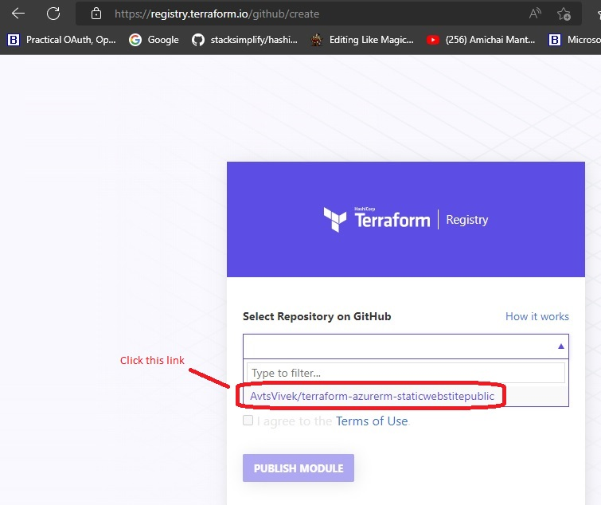

# Azure Static Website using Storage Account
- This module provisions Azure Storage Account for static website hosting.
- This is just for Terraform Demo's
- Version 5.0.0

## Steps to create a new release

- Make changes and push to GitHub. Then got to release in github

- Draft a new Release in GitHub

- Select Tag, title, and description

- Now, on the Terraform Registry, login and select modules

- Select a repo on Registry, login and select modules

- Sync Module

